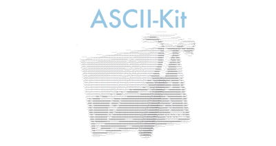

---

How to use
---
Drag `ASCIIKit.xcodeproj` into your project and add it into `Embedded Binaries`

Original Image:  

To generate ASCII single character colorful matrix:

    testImage.ASCIIGenerateColorfulMatrixWithSingleCharacter("#", pixelsPerSymbol: 2) { (attributedString) -> Void in
      let image = attributedString.generateImage()
    }

To generate ASCII single character grey scale matrix:

    testImage.ASCIIGenerateGrayScaleMatrixWithSingleCharacter("#", pixelsPerSymbol: 2) { (attributedString) -> Void in
      let image = attributedString.generateImage()
    }

To generate ASCII multi character grey scale matrix:

        testImage.ASCIIGenerateGrayScaleMatrixWithSingleCharacter(symbol, pixelsPerSymbol: 2) { (attributedString) -> Void in
          let image = attributedString.generateImage()
        }

See more detail in the demo project~.
